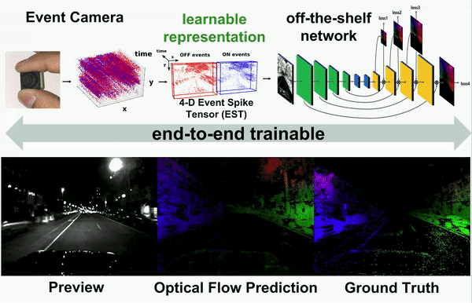
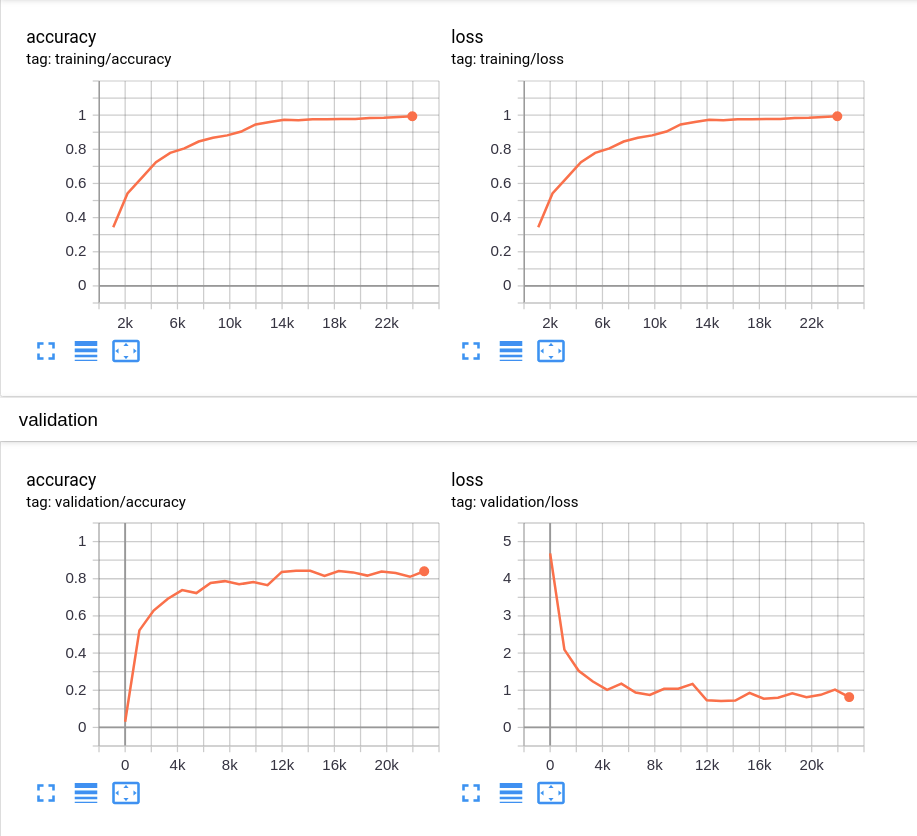

# Event Representation Learning

[](https://youtu.be/bQtSx59GXRY)

This repository contains learning code that implements 
event representation learning as described in Gehrig et al. ICCV'19. The paper can be found [here](http://rpg.ifi.uzh.ch/docs/ICCV19_Gehrig.pdf)

If you use this code in an academic context, please cite the following work:

[Daniel Gehrig](https://danielgehrig18.github.io/), [Antonio Loquercio](https://antonilo.github.io/), Konstantinos G. Derpanis, Davide Scaramuzza, "End-to-End Learning of Representations 
for Asynchronous Event-Based Data", The International Conference on Computer Vision (ICCV), 2019

```
@InProceedings{Gehrig_2019_ICCV,
  author = {Daniel Gehrig and Antonio Loquercio and Konstantinos G. Derpanis and Davide Scaramuzza},
  title = {End-to-End Learning of Representations for Asynchronous Event-Based Data},
  booktitle = {Int. Conf. Comput. Vis. (ICCV)},
  month = {October},
  year = {2019}
}
```

## Requirements

* Python 3.7
* virtualenv
* cuda 10

## Dependencies
Create a virtual environment with `python3.7` and activate it

    virtualenv venv -p /usr/local/bin/python3.7
    source venv/bin/activate

Install all dependencies by calling 

    pip install -r requirements.txt
   
## Training
Before training, download the `N-Caltech101` dataset and unzip it

    wget http://rpg.ifi.uzh.ch/datasets/gehrig_et_al_iccv19/N-Caltech101.zip 
    unzip N-Caltech101.zip
    
Then start training by calling

    python main.py --validation_dataset N-Caltech101/validation/ --training_dataset N-Caltech101/training/ --log_dir log/temp --device cuda:0

Here, `validation_dataset` and `training_dataset` should point to the folders where the training and validation set are stored.
`log_dir` controls logging and `device` controls on which device you want to train. Checkpoints and models with lowest validation loss will be saved in the root folder of `log_dir`.

### Additional parameters 
* `--num_worker` how many threads to use to load data
* `--pin_memory` wether to pin memory or not
* `--num_epochs` number of epochs to train
* `--save_every_n_epochs` save a checkpoint every n epochs.
* `--batch_size` batch size for training

### Visualization

Training can be visualized by calling tensorboard

    tensorboard --logdir log/temp

Training and validation losses as well as classification accuracies are plotted. In addition, the learnt representations are visualized. The training and validation curves should look something like this:    


## Testing
Once trained, the models can be tested by calling the following script:

    python testing.py --test N-Caltech101/testing/ --device cuda:0

Which will print the test score after iteration through the whole dataset.

    
